# 📦 Projeto de Gerenciamento de TaskTokens com Step Functions

Este repositório contém uma solução completa para gerenciamento de `taskToken` no contexto de workflows da AWS Step Functions. Ele contempla backend com Apache Camel, duas Lambdas integradas com SQS e DynamoDB, um frontend para visualização e resposta das tarefas, além da definição completa da State Machine em formato ASL (Amazon States Language).

---

## 🗂️ Estrutura do Projeto

```bash
.
├── applications/
│   └── app-callback-ec2/         # Aplicação Camel responsável pelos endpoints HTTP
├── frontend/
│   └── index.html                # Frontend em HTML + Bootstrap
├── lambdas/
│   ├── lambda-formatter/        # Lambda que recebe o input da State Machine
│   └── lambda-trigger-sqs/      # Lambda que escuta a fila SQS e salva no DynamoDB
└── state-machine/
    └── state-machine.asl.json   # Definição da Step Function (ASL)
```

---

## 🚦 Orquestração com Step Functions

O arquivo [`state-machine.asl.json`](state-machine/state-machine.asl.json) define o fluxo de aprovação com utilização de `callback` via SQS. A Step Function é composta pelas seguintes etapas:

### 🧠 Lógica da State Machine

| Estado                    | Tipo     | Ação                                                                                       |
|---------------------------|----------|--------------------------------------------------------------------------------------------|
| `Lambda Invoke`           | `Task`   | Invoca a Lambda `lambda-formatter`, passando o payload inicial.                           |
| `EnviarParaFilaAprovacao`| `Task`   | Envia a mensagem para a fila SQS com `waitForTaskToken`, aguardando o callback da decisão.|
| `AguardarRespostaAprovacao` | `Choice` | Avalia o campo `result` para decidir entre aprovação ou rejeição.                         |
| `ProcessarAprovacao`      | `Pass`   | Indica que o pedido foi aprovado.                                                         |
| `ProcessarRejeicao`       | `Pass`   | Indica que o pedido foi rejeitado.                                                        |
| `Success`                 | `Succeed`| Encerramento do fluxo com sucesso.                                                        |

---

## 🚀 Visão Geral dos Componentes

### `applications/app-callback-ec2`

Aplicação Camel responsável por:

- Expor endpoints REST para consulta e atualização de `taskTokens`.
- Interagir com a AWS Step Functions utilizando os `taskTokens` recebidos via callback.

#### 📘 OpenAPI

- `GET /tasks?status=PENDING|APPROVED|REJECTED`: Lista tasks por status.
- `PUT /tasks`: Insere novo taskToken.
- `POST /tasks/{taskToken}`: Atualiza o status e envia resposta para a Step Function.

---

### `frontend/index.html`

Frontend responsivo com Bootstrap 5 que permite:

- Buscar tasks por status.
- Visualizar e aprovar/rejeitar tasks pendentes.
- Interagir diretamente com o backend via REST.

---

### `lambdas/`

#### 🧩 lambda-formatter

- Invocada pela Step Function.
- Recebe o input inicial e o prepara para envio à fila SQS.

#### 📥 lambda-trigger-sqs

- Acionada por trigger da SQS.
- Persiste no DynamoDB os dados enviados, incluindo `taskToken`, `executionId`, `businessKey`, `status` e `executionStartTime`.

Exemplo de item no DynamoDB:

```json
{
  "executionId": { "S": "arn:aws:states:..." },
  "businessKey": { "S": "my-business-key-02" },
  "executionStartTime": { "S": "2025-04-01T01:13:11.206Z" },
  "status": { "S": "REJECTED" },
  "taskToken": { "S": "AQB8AAAAKgAAAAM..." }
}
```

---

## 🧰 Tecnologias Utilizadas

- **Apache Camel** (Spring Boot)
- **AWS Lambda**
- **AWS Step Functions**
- **AWS SQS**
- **AWS DynamoDB**
- **OpenAPI 3.0**
- **HTML5 + Bootstrap 5**

---

## ✅ Pré-requisitos

- Java 17+
- Maven
- AWS CLI configurado
- Permissões adequadas no IAM para Step Functions, Lambda, SQS e DynamoDB

---

## 📦 Execução Local

### Backend (Camel)

```bash
cd applications/app-callback-ec2
./mvnw spring-boot:run
```

### Frontend

Temos como opcao a extension do VScode chamada de Live Server

```bash
# Alternativa: abrir diretamente no navegador
npx serve frontend
```

---

## Fluxos exemplificados
### Fluxo de aprovacao

1. Envio de Request para State Machine 
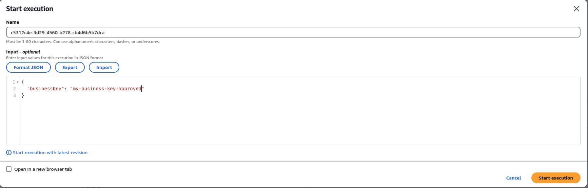

2. Fluxo 'parado' no waitTaskToken esperando um callback para a State Machine. 


3. Listar Tasks com Status PENDING
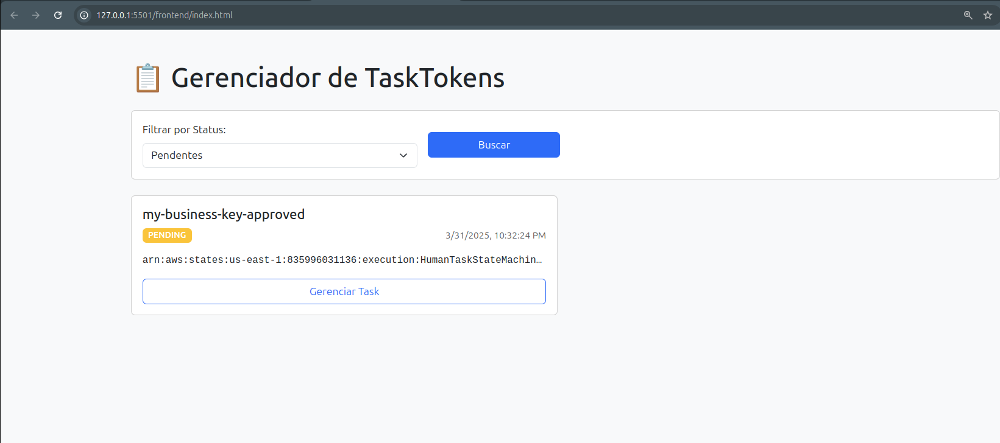

4. Selecionando e aprovando a Task
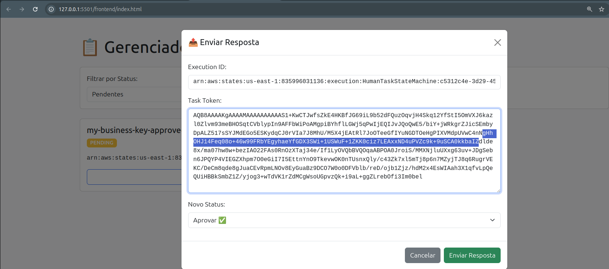

5. Workflow com a aprovacacao do Workflow
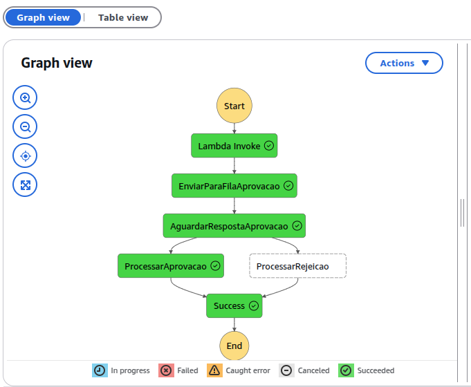

6. Listar Tasks com Status APPROVED
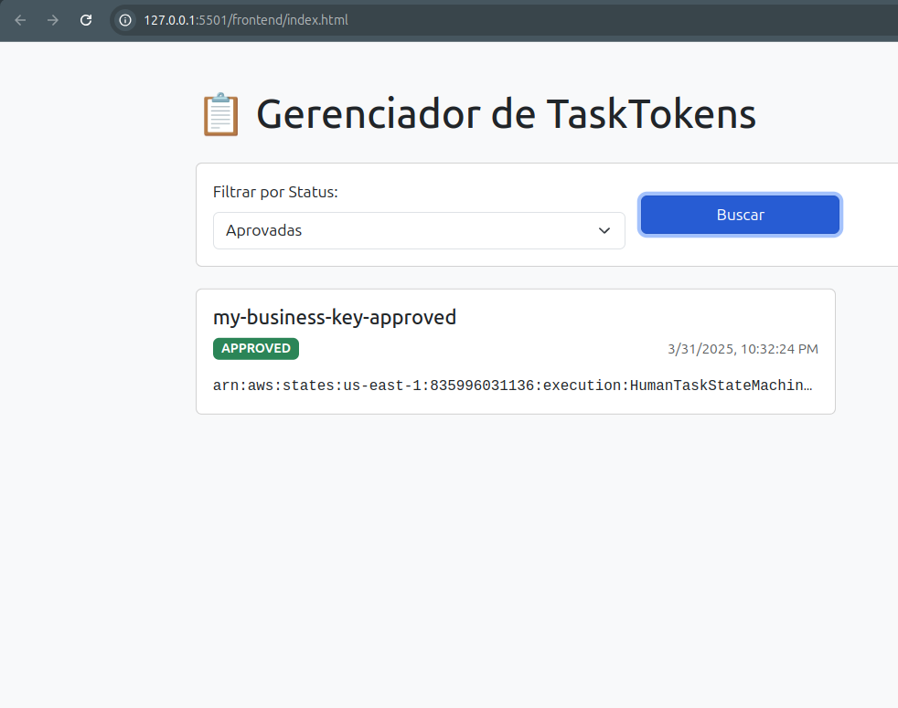

### Fluxo de rejeicao

1. Envio de Request para State Machine 
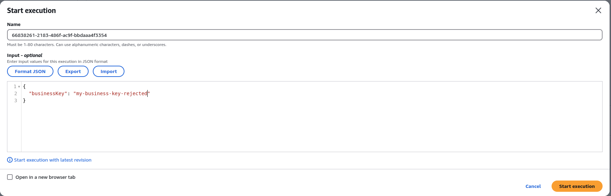

2. Fluxo 'parado' no waitTaskToken esperando um callback para a State Machine. 
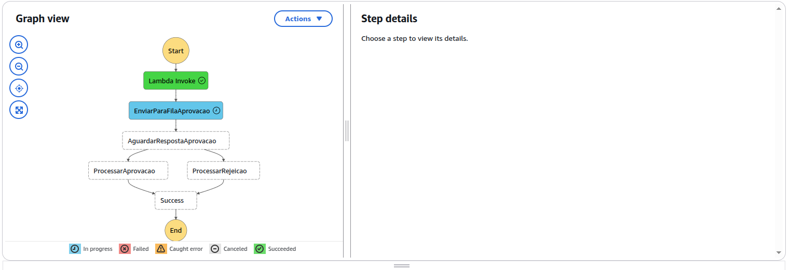

3. Listar Tasks com Status PENDING
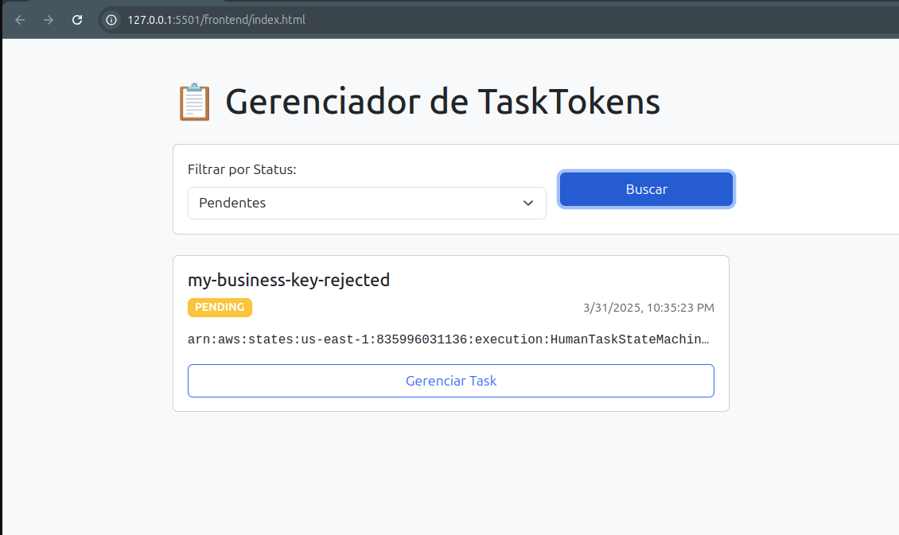

4. Selecionando e rejeitando a Task
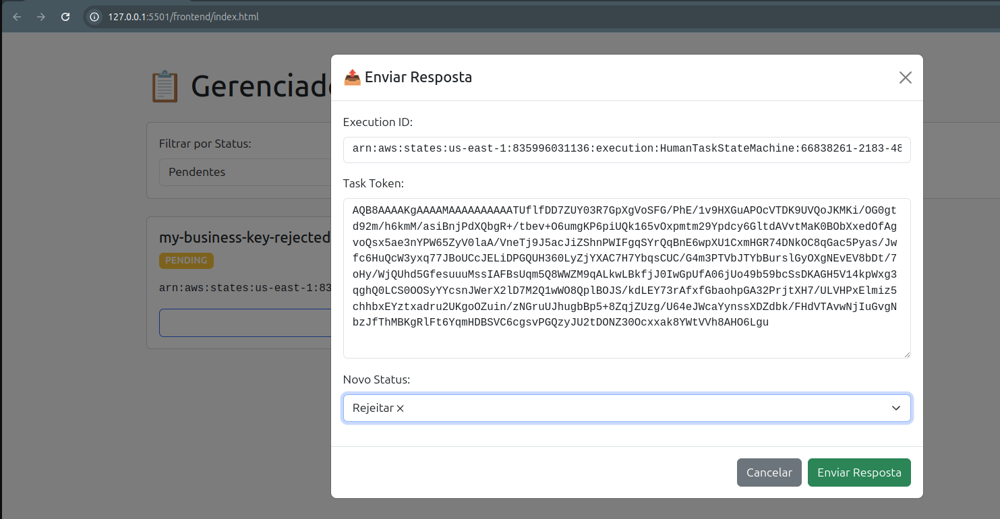

5. Workflow com a rejeicao do Workflow
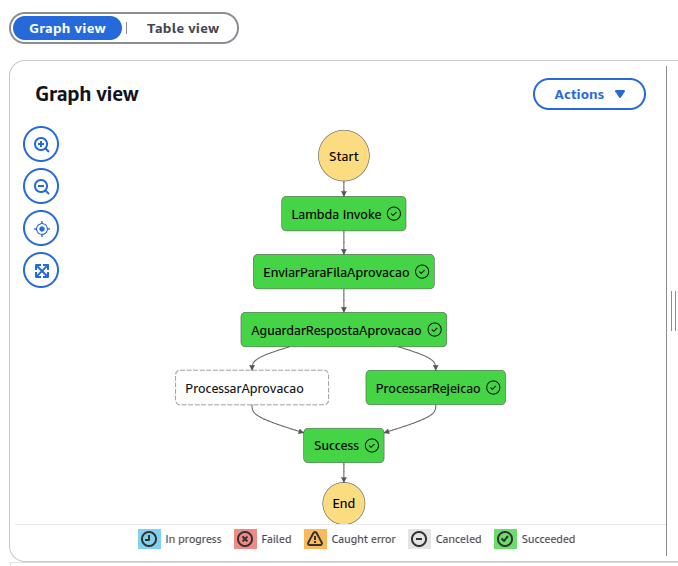

6. Listar Tasks com Status REJECTED
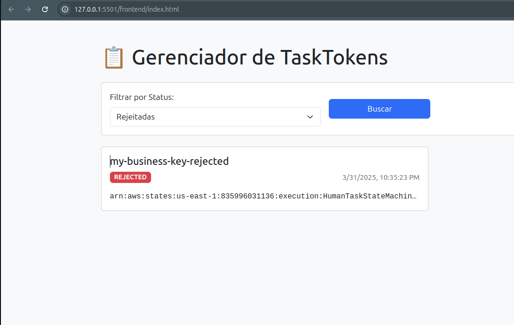

## cURLs de exemplo

### GET
```bash
curl --location 'http://localhost:8080/camel/tasks?status=PENDING'
```


### PUT
```bash
curl --location --request PUT 'http://localhost:8080/camel/tasks' \
--header 'Content-Type: application/json' \
--data '{
    "transactionId": "arn:aws:states:us-east-1:123456789012:execution:StepFunctions:abcd1234",
    "orderId": "2",
    "startTime": "2025-02-24T19:47:36.818Z",
    "status": "PENDING",
    "taskToken": "AQCEAAAAKgAAAAMAAAAAAAAAAZRivnkXpxJ..."
}'
```

### POST
```bash
curl --location 'http://localhost:8080/camel/callback' \
--header 'Content-Type: application/json' \
--data '    {
        "status": "REJECTED",
        "executionId":"arn:aws:states:us-east-1:835996031136:execution:SqsWithDynamoDBStateMachine:94c8ba60-d502-46b5-a21c-9f332eb525ee",
        "taskToken":"xxxxxxxxx"
    }'
```

## 📝 Notas

- O projeto pode ser adaptado para múltiplos tipos de aprovações humanas.
- O tempo de espera para resposta no `waitForTaskToken` é de 120 segundos (`TimeoutSeconds`).
- A fila `state-machine-queue` deve estar configurada para acionar a `lambda-trigger-sqs`.
